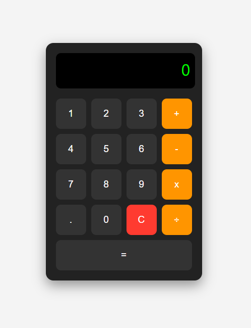

# Basic Calculator (HTML + CSS + JavaScript)

A simple, interactive calculator built using **HTML**, **CSS Grid**, and **Vanilla JavaScript**.  
This project helps beginners understand DOM manipulation, event handling, operators, and layout using CSS Grid.

---

## Features

- Real-time input display
- Basic math operations: Addition, Subtraction, Multiplication, Division
- Clear (`C`) button to reset input
- Error handling for invalid expressions
- Responsive button layout using **CSS Grid**
- Keyboard-free interaction (button-based)

---

## Tech Stack

- **HTML5** – Structure of the calculator
- **CSS3 (Grid)** – Stylish and responsive button layout
- **JavaScript** – Handles all the logic and interactions

---

## Screenshot



---

## Demo Link


---

## Folder Structure

calculator/
├── calc.png
├── index.html
├── README.md
├── script.js
└── style.css

---

## How It Works

- Numbers and operators are displayed in the input screen when buttons are clicked.
- Pressing `=` will evaluate the expression using `eval()` (JavaScript’s built-in calculator).
- Prevents duplicate operators like `++` or `--`.

---

## Getting Started

Just open the `index.html` file in your browser:

```bash
# No installation needed
# Open this in your browser
# Or live preview it using Live Server in VS Code.
```

---
